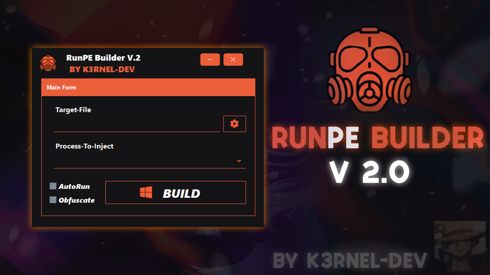

# RunPE-Builder



## 👋 About:
```
RunPE-Builder is a tool designed to convert executable files into encrypted listings. 
These listings are then loaded into a stub by the builder, which decrypts and injects the executable code into legitimate processes during runtime. 
This technique enhances stealth by hiding the malicious payload in memory and executing it within the context of a trusted process.
```
## 🏴‍☠️ Features:
- **Encryption of Executables: Converts executable files into encrypted listings for secure storage and transfer.
- **In-Memory Decryption: Decrypts the executable code in memory to avoid detection by traditional file-based antivirus solutions.
- **Process Injection: Injects the decrypted executable code into legitimate processes, enhancing stealth and bypassing security mechanism
- **User-Friendly Interface: Easy-to-use GUI for building and managing stubs and payloads.

## 📷 Video-Proof:


## 👤 Author:
```
Developed by k3rnel-dev.
```

## ⚠️ Disclaimer:
```
This open-source project is provided for educational purposes only. 
The author assumes no responsibility for any misuse or illegal activities performed with this software.
Users are solely responsible for ensuring that their use of this tool complies with all applicable laws and regulations.
```